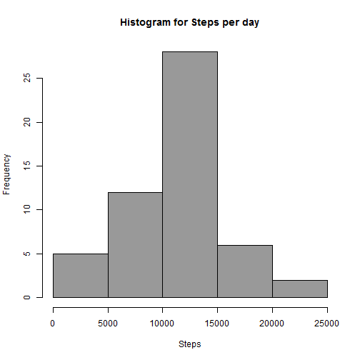
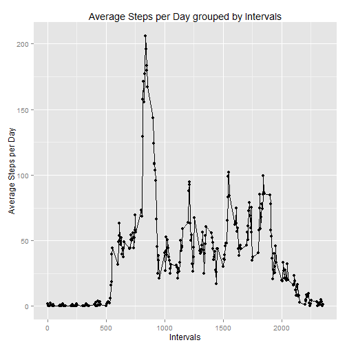
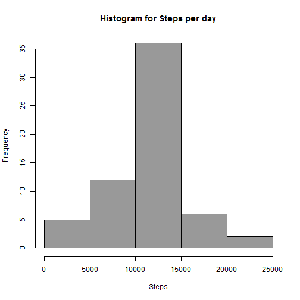
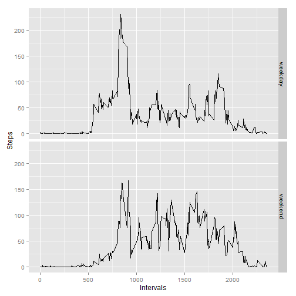

Reproducible Research - Course Project 1
==========================================
Andreas Avgousti  

##1. Introduction.

It is now possible to collect a large amount of data about personal movement using activity monitoring devices such as a Fitbit, Nike Fuelband, or Jawbone Up. These type of devices are part of the "quantified self" movement - a group of enthusiasts who take measurements about themselves regularly to improve their health, to find patterns in their behavior, or because they are tech geeks. But these data remain under-utilized both because the raw data are hard to obtain and there is a lack of statistical methods and software for processing and interpreting the data.

This assignment makes use of data from a personal activity monitoring device. This device collects data at 5 minute intervals through out the day. The data consists of two months of data from an anonymous individual collected during the months of October and November, 2012 and include the number of steps taken in 5 minute intervals each day.

##2. Details of Data - Quick Look.

The data for this assignment can be downloaded from the [course web site][1]. 

[1]:https://d396qusza40orc.cloudfront.net/repdata%2Fdata%2Factivity.zip

The variables included in this dataset are:

   1. **steps:**    Number of steps taking in a 5-minute interval (missing values are coded as NA)
   2. **date:**     The date on which the measurement was taken in YYYY-MM-DD format
   3. **interval:** Identifier for the 5-minute interval in which measurement was taken

The dataset is stored in a comma-separated-value (CSV) file and there are a total of 17,568 observations in this dataset.

Let's see how the data looks like. But first, we need to bring the data into R:


```r
data<-read.csv("activity.csv", header = TRUE)
head(data, 15)
```

```
##    steps       date interval
## 1     NA 2012-10-01        0
## 2     NA 2012-10-01        5
## 3     NA 2012-10-01       10
## 4     NA 2012-10-01       15
## 5     NA 2012-10-01       20
## 6     NA 2012-10-01       25
## 7     NA 2012-10-01       30
## 8     NA 2012-10-01       35
## 9     NA 2012-10-01       40
## 10    NA 2012-10-01       45
## 11    NA 2012-10-01       50
## 12    NA 2012-10-01       55
## 13    NA 2012-10-01      100
## 14    NA 2012-10-01      105
## 15    NA 2012-10-01      110
```

##3. Answers to Assignments Queries.

The assignment requires answers to some questions. You can find below separately each question, with the analysis made and the result deriving from R. 

***3.1 What is mean total number of steps taken per day?***  

**Note:** *For this part of the assignment, assume that there are no missing values in the dataset.*  

In order to calculate the mean and median per day, we created a the data frame "data_q1" the sums the total steps per day. Then, we created a histogram showing the frequence of steps per day. And lastly, we have calculated and presented the mean and the median. Here is the code: 

```r
data_q1<-aggregate(data$steps, by=list(date = data$date), FUN=sum)
names(data_q1)<-c("date","steps")
hist(data_q1$steps, xlab = "Steps", main = "Histogram for Steps per day", col="gray60")
```

 

```r
mymean<-mean(data_q1$steps, na.rm = TRUE)
mymedian<-median(data_q1$steps, na.rm = TRUE)
```

The mean of steps per day is 1.0766189 &times; 10<sup>4</sup> and the median is 10765.

***3.2 What is the average daily activity pattern?***

In order to identify the pattern we firstly created the relevant data ie the data frame "data_q2" that contains the average steps grouped by interval level. Here is the code:


```r
data_q2<-aggregate(steps~interval, data, mean)
```

Next, in order to create a plot to visualise those data, we have brought from library 'ggplot2' package and we have created the plot. It is easily identifialbe at which interval level the average step per day is maximum. 


```r
library(ggplot2)
g<-qplot(interval, steps, data=data_q2, xlab = "Intervals", ylab = "Average Steps per Day", main = "Average Steps per Day grouped by Intervals")
g+geom_line()
```

 

```r
mymaxstep<-max(data_q2$steps)
mymaxinterval<-data_q2[match(mymaxstep, data_q2$steps),1]
```

The maximum average steps is 206.1698113 at the level of 835 intervals. 

***3.3 Imputing missing values***

Fistly, we have counted how many records are not complete cases ie they have at least one missing value. Here is the code:


```r
mynum<-sum(!complete.cases(data))
```

There are 2304 incomplete cases in our database. 

We have replaced missing values with the value of the average steps at the certain level of Intervals. We used the dataframe created in section 3.1


```r
for (i in 1:17568) {
        if (is.na(data[i,1])){
                data[i,1]<-data_q2[match(data[i,3],data_q2$interval),2]
        }
}
```

After replacing missing values with the mean, we have created a new histogram, just to have a look at the new data. Here is the code:


```r
data_q3<-aggregate(data$steps, by=list(date = data$date), FUN=sum)
names(data_q3)<-c("date","steps")
hist(data_q3$steps, xlab = "Steps", main = "Histogram for Steps per day", col="gray60")
```

 

Finally we have calculated the new mean and median and we have conlcuded into the following conclusions. But first let's have a look at the code:


```r
my_mean_update<-mean(data_q3$steps)
my_median_update<-median(data_q3$steps)

my_mean_diff<-mymean-my_mean_update
my_median_diff<-mymedian-my_median_update
```

The imputed mean is 1.0766189 &times; 10<sup>4</sup> and the imputed median is 1.0766189 &times; 10<sup>4</sup>

The differences from the non-imputed mean and median are 0 and -1.1886792 accordingly. 

***3.4 Are there differences in activity patterns between weekdays and weekends?***

To answer this firstly we needed to add a column in our dataset indicating whether the day is "weekday" or "weekend". Here is the code: 


```r
data$date<-as.POSIXct(as.character(data$date))
data$day<-weekdays(data$date)
for (i in 1:17568){
        if ((data[i,4]=="Monday")|(data[i,4]=="Tuesday")|(data[i,4]=="Wednesday")|(data[i,4]=="Thursday")|(data[i,4]=="Friday")){
                data$factor1[i]<-"weekday"
        }
        else if ((data[i,4]=="Saturday")|(data[i,4]=="Sunday")){
                data$factor1[i]<-"weekend"
        }
}
```

After creation of the new column (indicating whether the measurement was made during weekday or weekend), we would like to illustrate the data to see wheter there is difference in activity patterns. Here is the code and the plots:


```r
data_q4<-aggregate(steps~interval+factor1, data=data , mean)

g<-ggplot(data_q4, aes(interval, steps)) 
g+ geom_line() + facet_grid(factor1 ~ .) + xlab("Intervals") + ylab("Steps")
```

 

***This is the end of this assignemnt!!!***


